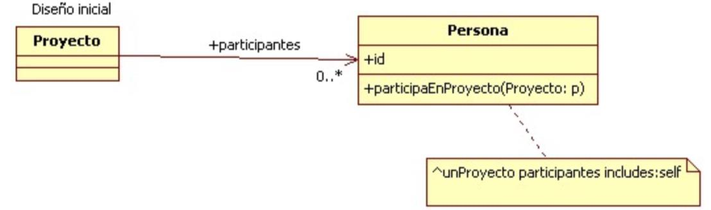
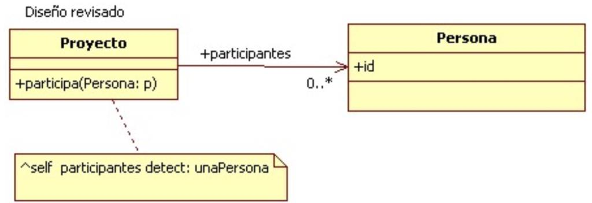

# Ejercicio 5-3: Refactoring

3. Al revisar el siguiente diseño inicial (Figura 2), se decidió realizar un cambio para evitar lo que se consideraba un mal olor. El diseño modificado se muestra en la Figura 3. Indique qué tipo de cambio se realizó y si lo considera apropiado. Justifique su respuesta.

---

|  | 
|:--:| 
| *DIagrama de clases del diseño inicial.* |

---

|  | 
|:--:| 
| *DIagrama de clases modificado.* |

---

- En el diseño inicial, es responsabilidad de la persona saber si participa en un proyecto o no, retornando true o false.
- En el diseño inicial, el método utiliza el atributo participantes de Proyecto (code smell `Feature Envy`).  

- En lugar de devolver un boolean devolverá el objeto persona o Nil en caso de que no se encuentre.
- El objecto persona queda sin ningún comportamiento. Siendo esto así, se podría pensar que no es necesario dicho objeto (code smell `Data Class`).

Por lo tanto, en el diseño modificado se produjo un cambio de comportamiento. El refactoring es incorrecto.

Se debería haber mantenido el método `participaEnProyecto` en la clase Persona, y modificarlo de la siguiente forma:

```smalltalk
Persona>> participaEnProyecto: unProyecto

    ^ unProyecto incluyePersona: self
```

```smalltalk
Proyecto>> incluyePersona: unaPersona

    ^ self participantes includes: unaPersona
```

De esta forma, se resuelve el code smell `Feature Envy` y se logra mantener el comportamiento del diseño inicial.